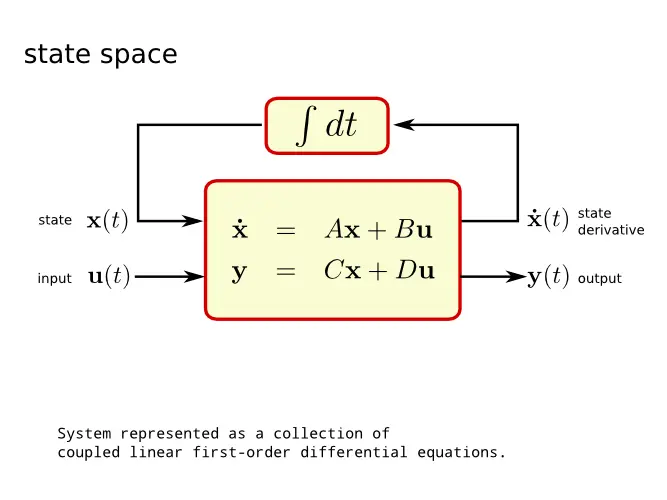
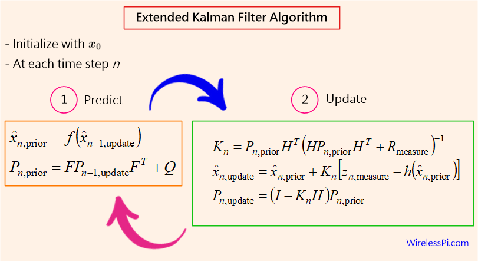

# Adaptive Online Kalman Estimator
Short-Horizon Forecasting under Non-Stationarity
A disciplined benchmark study of an online adaptive Kalman state-space estimator versus naïve baselines in a noisy, non-stationary time series.
________________________________________
# Overview
This repository implements a real-time adaptive Kalman filter for short-horizon forecasting and evaluates it against simple, widely used baselines.
The project focuses on estimation quality, not trading signals.
•	No backtesting
•	No look-ahead
•	No profitability claims
The system is designed to operate online, under continuously changing noise conditions.
________________________________________
# Problem Statement
Short-horizon forecasting in real systems (financial markets, industrial sensors, energy signals) is dominated by:
•	Non-stationarity
•	Noise bursts and regime changes
•	Lag in static smoothing methods
The core question addressed here is:
Can an adaptive state-space estimator reduce magnitude error and recover faster from disturbances compared to naïve models?
________________________________________
# Model Formulation
The estimator is implemented as a linear state-space model with explicit, interpretable dynamics.
Equations are rendered as images to ensure consistent display across GitHub themes.
________________________________________
# State Vector
The latent state is defined as:

Where:
•	ptp_tpt is the estimated price
•	vtv_tvt is the estimated short-term velocity
________________________________________
# State Transition Model (Constant Velocity)
The system assumes locally linear dynamics:

Where:
•	wtw_twt represents process noise
•	Velocity is constrained to maintain physical plausibility
________________________________________
# Measurement Model
Only the price component is observed:

Where:
•	vtv_tvt represents measurement noise
•	Measurement noise is adapted online using innovation statistics
________________________________________
# Adaptive Noise Handling
To operate under changing conditions:
•	Measurement noise (R) adapts based on innovation variance
•	Process noise (Q) adapts slowly to reflect model mismatch
Key design principles:
•	No indicator-driven noise manipulation
•	No hindsight or replay
•	Clear separation between estimation and evaluation
A warm-up phase is enforced to prevent initialization artifacts.
________________________________________
# Baseline Models
The Kalman estimator is benchmarked against:
•	Persistence (Random Walk)
p^t+h=pt\hat{p}_{t+h} = p_tp^t+h=pt 
•	EMA(10)
•	EMA(20)
These baselines represent minimal-assumption methods commonly used in practice.
________________________________________
# Evaluation Methodology
Online Walk-Forward Validation
•	Predictions are generated at time ttt
•	Validation occurs only after the forecast horizon matures
•	No retrospective fitting
Forecast horizons:
•	+5 minutes
•	+10 minutes
•	+20 minutes
Metrics
For each model and horizon:
•	Mean Absolute Error (MAE)
•	Root Mean Squared Error (RMSE)
•	Directional Accuracy (sign only)
No binary “pass/fail” logic is used.
________________________________________
# Observed Behavior (Live Runs)
Empirical observations from live execution:
•	Direction frequently fails for all models during micro-reversals
•	EMA and persistence remain competitive at very short horizons
•	The Kalman estimator often:
o	Reduces magnitude error at longer horizons
o	Re-anchors faster after volatility disturbances
o	Exhibits lower lag than exponential smoothing
These behaviors align with state estimation, not directional prediction.
________________________________________
# Limitations
This project explicitly does not claim:
•	Trading profitability
•	Directional market predictability
•	Optimal parameter tuning
Known constraints:
•	Linear dynamics assumption
•	No regime classification
•	No nonlinear or asymmetric state modeling
These limitations are intentional to preserve clarity and interpretability.
________________________________________
# Why This Matters Beyond Finance
Although demonstrated on BTC price data, the methodology applies directly to:
•	Industrial sensor estimation
•	Energy demand smoothing
•	Control systems under noisy measurements
•	Predictive maintenance signals
•	Real-time monitoring systems
The asset is incidental — the estimator is the contribution.
________________________________________
# Repository Structure
adaptive-kalman-estimator/
│
├── kalman.py          # Online estimator & data collection
├── results.csv        # Logged predictions and observations
├── analysis.ipynb     # Offline evaluation & metrics
├── README.md
└── figures/
    ├── state_vector.png
    ├── state_transition.png
    └── measurement_model.png
________________________________________
# Future Work
Possible extensions include:
•	Regime-aware switching models
•	Higher-order (acceleration) dynamics
•	Confidence-weighted directional gating
•	Application to industrial or energy datasets
________________________________________
# Final Note
This project is intentionally conservative.
In a domain dominated by overfitting and narrative bias,
transparent methodology and honest benchmarking are the result.

